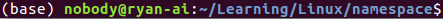

create a mount namespace. -U will create a new usernamespace(It does not map any user)
unshare -Um

After this we can add a mapping into the new usernamespace

cd ${CONTAINER_ROOT_FOLDER}

wget https://dl-cdn.alpinelinux.org/alpine/v3.13/releases/x86_64/alpine-minirootfs-3.13.1-x86_64.tar.gz

###create user and group
sudo useradd container-user

##create user namespace and mount namespace
unshare --user --mount  --map-root-user bash --norc
newuidmap 30531 0 1000 1000

##bind mount a directory
sudo chown -R $USER:$USER /container_practice
export CONTAINER_ROOT_FOLDER=/container_practice
mount --bind ${CONTAINER_ROOT_FOLDER}/fakeroot ${CONTAINER_ROOT_FOLDER}/fakeroot
cd ${CONTAINER_ROOT_FOLDER}/fakeroot

//this will change the root
mkdir old_root
pivot_root . old_root
PATH=/bin:/sbin:$PATH
umount -l /old_root => /proc is not available in the new user namespace.